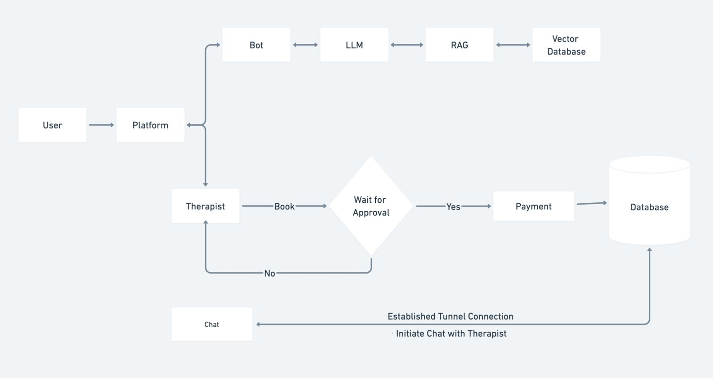
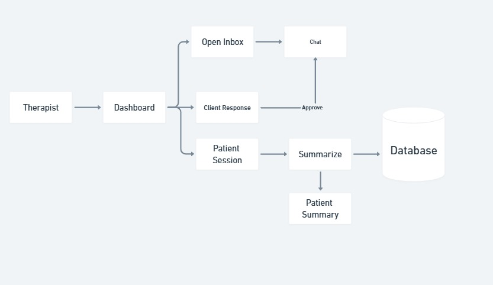

# TheraBot: AI Mental Health Companion & Therapist Booking Platform

TheraBot is a **SaaS-based mental health assistant** that helps individuals manage stress, anxiety, depression, PTSD, and more.
Users **can talk freely with an empathetic AI chatbot**, and if needed, **connect with verified therapists via chat, audio, or video sessions**—all from one secure platform.

# Table of Contents:

1. [Introduction](#introduction)
2. [Objective](#objecttive)
3. [Technology Stack](#technology-stack)
4. [How it works](#how-it-works)
5. [Project Setup](#project-setup)
6. [License](#license)

## Introduction
TheraBot is a **SaaS-based mental health assistant** that helps individuals manage stress, anxiety, depression, PTSD, and more.
Users **can talk freely with an empathetic AI chatbot**, and if needed, **connect with verified therapists via chat, audio, or video sessions**—all from one secure platform.
It also includes **Summarizing Agent** feature that helps Therapist to know about patient history in detail rather using traditional method.
The Platform includes real-time chat feature, the clients can easily communicate with each other. The messages are stored in encrypted format, to ensure clients privacy.

## Objective
- Provide 24/7 AI-based mental health support.
- Enable confidential and secure therapist connections.
- Reduce the stigma around seeking help for mental health.

## Technology Stack

1. Django Framework.
2. React.js Tailwindcss.
3. Langchain.
4. Huggingface Embeddings.
5. Llama3.2 (fine-tuned model for chatbot).
6. FAISS (vector database).
7. Sqlite3.
8. Langgraph (Agent).

## How it works:

Patient Architecture

Therapist Architecture

## Dataset Reference:

# Still working in progress
